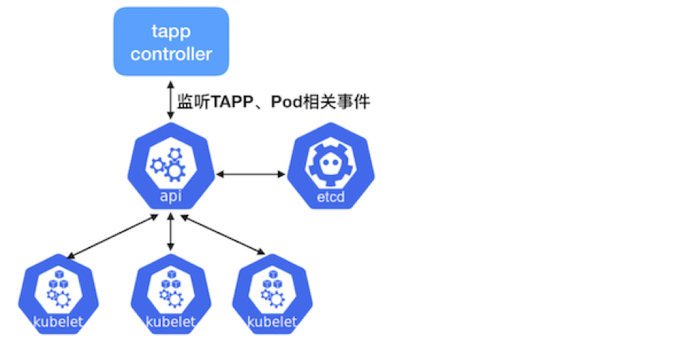

# TAPP
但Kubernetes现有应用类型（如：Deployment、StatefulSet等）无法满足很多非微服务应用的需求，比如：操作（升级、停止等）应用中的指定pod、应用支持多版本的pod。如果要将这些应用改造为适合于这些workload的应用，需要花费很大精力，这将使大多数用户望而却步。
为解决上述复杂应用管理场景，基于Kubernetes CRD开发了一种新的应用类型TAPP，它是一种通用类型的workload，同时支持service和batch类型作业，满足绝大部分应用场景，它能让用户更好的将应用迁移到Kubernetes集群。
如果用Kubernetes的应用类型类比，TAPP ≈ Deployment + StatefulSet + Job ，它包含了Deployment、StatefulSet、Job的绝大部分功能，同时也有自己的特性，并且和原生Kubernetes相同的使用方式完全一致。
TAPP是一种用户自定义资源（CRD），TAPP controller是TAPP对应的controller/operator，它通过kube-apiserver监听TAPP、Pod相关的事件，根据TAPP spec和status进行相应的操作：创建、删除pod等。

## TAPP 特点

功能点 | Deployment | StatefulSet | TAPP
---------------|-------|--------|--------
Pod唯一性 | 无 | 每个Pod有唯一标识 | 每个Pod有唯一标识
Pod存储独占 | 仅支持单容器 | 支持 | 支持
存储随Pod迁移 | 不支持 | 支持 | 支持
自动扩缩容 | 支持 | 不支持 | 支持
批量升级 | 支持 | 不支持 | 支持
严格顺序更新 | 不支持 | 支持 | 不支持
自动迁移问题节点 | 支持 | 不支持 | 支持
多版本管理 | 同时只有1个版本 | 可保持2个版本 | 可保持多个版本
Pod原地升级 | 不支持 | 不支持 | 支持
IP随Pod迁移 | 不支持 | 支持 | 支持

1. 实例具有可以标识的id

   实例有了id，业务就可以将很多状态或者配置逻辑和该id做关联，当容器迁移时，通过TAPP的容器实例标识，可以识别该容器原来对应的数据，实现带云硬盘或者数据目录迁移 

1. 每个实例可以绑定自己的存储

   通过TAPP的容器实例标识，能很好地支持有状态的作业。在实例发生跨机迁移时，云硬盘能跟随实例一起迁移

1. 实现真正的灰度升级/回退

   Kubernetes中的灰度升级概念应为滚动升级，kubernetes将pod”逐个”的更新，但现实中多业务需要的是稳定的灰度，即同一个app，需要有多个版本同时稳定长时间的存在，TAPP解决了此类问题

1. 可以指定实例id做删除、停止、重启等操作

   对于微服务app来说，由于没有固定id，因此无法对某个实例做操作，而是全部交给了系统去维持足够的实例数

1. 对每个实例都有生命周期的跟踪

   对于一个实例，由于机器故障发生了迁移、重启等操作，很难跟踪和监控其生命周期。通过TAPP的容器实例标识，获得了实例真正的生命周期的跟踪，对于判断业务和系统是否正常服务具有特别重要的意义。TAPP还可以记录事件，以及各个实例的运行时间，状态，高可用设置等。

## TAPP 配置

