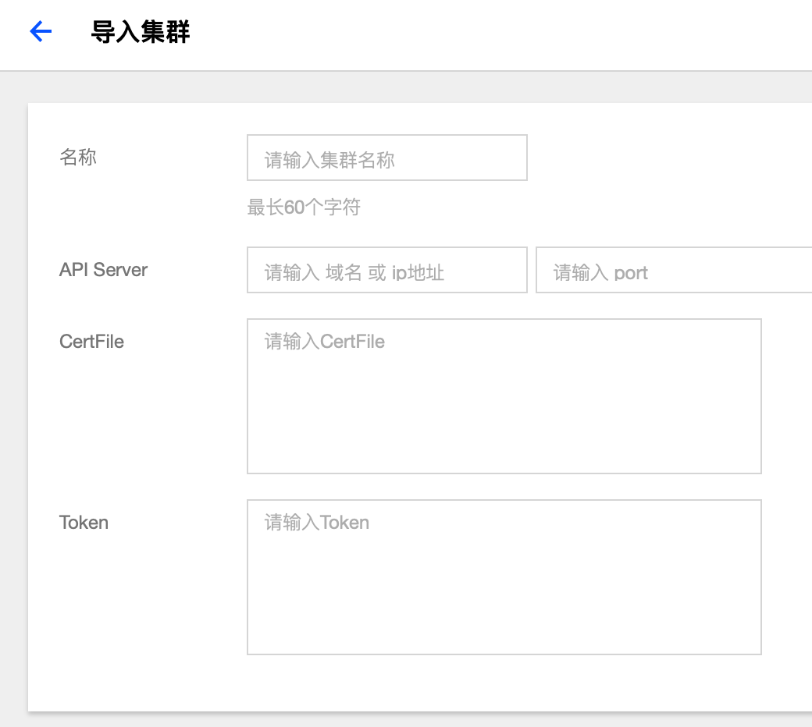

# 集群管理

## 概念
**在这里可以管理你的kubernetes集群**

## 操作步骤
+ **新建独立集群**
  
    1. 登录TKEStack
    2. 切换至 平台管理控制台
   3. 在集群管理页面中，单击 【新建独立集群】。如下图所示：
   
    4. 在 新建独立集群 页面，填写集群的基本信息。如下图所示：
   
   + **集群名称：** 支持****，小于N字符
   + **Kubernetes版本：** 选择合适的kubernetes版本，各版本特性对比请查看 [Supported Versions of the Kubernetes Documentation](https://kubernetes.io/docs/home/supported-doc-versions/)
   +  **网卡名称：** 
   +  **VIP：** 
   +  **GPU：**
      +  **pGPU：**
      +  **vGPU：**
   +  **容器网络：**
      +  **CIDR：**
      +  **Pod数量上限/节点：**
      +  **Service数量上限/集群：** 
   +  **目标机器：** 输入目标机器信息后单击保存，若保存按钮是灰色，单击边上空白处即可变蓝
      +  **目标机器：**
      +  **SSH端口：**
      +  **主机label：**
      +  **认证方式：**
         +  **密码认证：**
            +  **密码：**
         +  **密钥认证：**
            +  **私钥：**
            +  **私钥密码：**
      +  **GPU：** 
   +  **提交：**集群信息填写完毕后，提交按钮变为可提交状态，单击即可提交
   
+ **导入集群**
    1. 登录TKEStack
    2. 切换至 平台管理控制台
    3. 在集群管理页面，单击【导入集群】。如下图所示：
    
    4. 在 导入集群 页面，填写被导入的集群信息。如下图所示：
    
    + **名称：** 被导入集群的名称，最长60字符
    + **API Server：** 输入要被导入集群的API server的IP和端口
    + **CertFile：** 输入被导入集群的cert 文件内容
    + **Token：** 输入被导入集群创建时的token值
    5. 单击最下方 【提交】 按钮 
